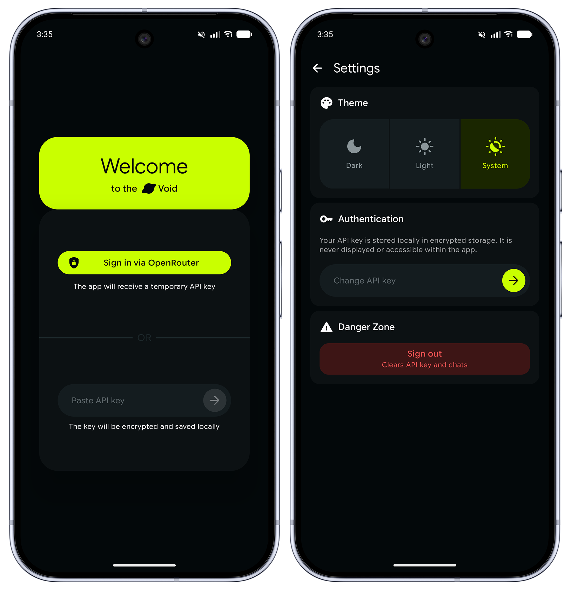
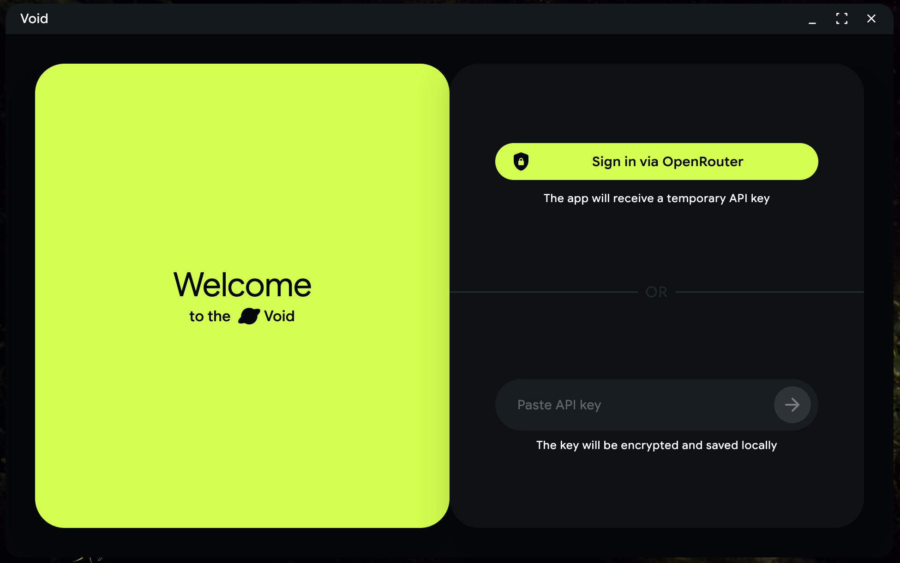
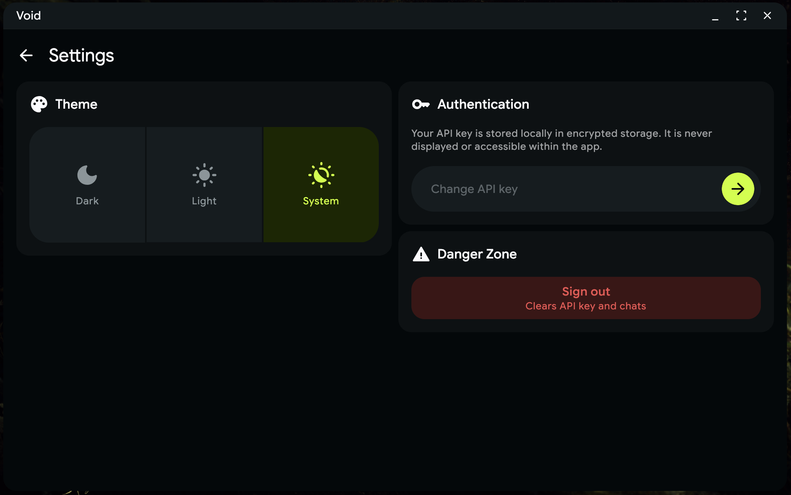

> [!CAUTION]
> **WORK IN PROGRESS — NOT PRODUCTION READY**
>
> This project is an early-stage (WIP) Kotlin Multiplatform application and is **not finished**.
> Many planned features are missing. The code is published primarily
> to showcase the architecture, tech stack, and engineering practices - it is used as a
> portfolio project rather than a shippable product.

**Void** is a cross-platform client for [OpenRouter](https://openrouter.ai), built with
Kotlin Multiplatform and Compose Multiplatform. The goal is a clean app to
browse AI models and chat with them from a single codebase across Android, iOS, and Desktop.

## Screenshots




## What is done

- **Multiplatform foundation** targeting **Android**, **iOS**, and **Desktop (JVM)** from a
  single Kotlin codebase (Compose Multiplatform UI).
- **Authentication** via two methods:
  - **OAuth 2.0 Authorization Code with PKCE**.
  - **Manual API key** entry with validation.
  - Secure, platform-specific storage.
- **App settings**:
  - Theme selection (**Light / Dark / System**) persisted across sessions.
  - Change API key, sign out (clears stored credentials).
- **Design system** with a custom Material 3 color scheme, typography (Google Sans Flex),
  reusable composable components, and Valkyrie-managed vector assets.
- **Navigation & state architecture** - Decompose + MVIKotlin.
- **Local persistence layer** set up for key-value preferences (DataStore).

## What is NOT done yet

The following core product features are **planned but not implemented**:

- Model catalog / model selection UI.
- **Chat** experience with models (messaging, streaming responses).
- **Conversation management** (history, persistence, switching between chats).
- **Model tuning** - exposing parameters such as `temperature`, `top_p`, `max_tokens`,
  `frequency_penalty`, `presence_penalty`, `seed`.

## Tech stack

| Area            | Technology                                                                 |
|-----------------|----------------------------------------------------------------------------|
| Language        | Kotlin 2.4.10                                                              |
| UI              | Compose Multiplatform, Material 3                                          |
| Architecture    | Decompose (navigation & components), MVIKotlin (MVI stores)                |
| DI              | Koin 4.2.2                                                                 |
| Networking      | Ktor 3.5.2 (client, content negotiation, logging)                          |
| Serialization   | kotlinx.serialization                                                      |
| Local storage   | Jetpack DataStore (preferences), Room 3 (database)                         |
| Secure storage  | Android Keystore / Tink, iOS Keychain, Java Keyring (Desktop)              |
| Async           | kotlinx.coroutines                                                         |
| Assets          | Valkyrie (vector icons)                                                    |
| Build           | Gradle Kotlin DSL, KSP, Android Gradle Plugin 9                            |

## Architecture overview

The project follows a **strictly multi-module** structure that separates reusable
infrastructure (`core:*`) from feature modules (`feature:*`):

```
core:network:client   Ktor HttpClient factory & network DI
core:auth             Auth domain: repository, DTOs, OAuth API service, use cases
core:security         Platform-agnostic secure API-key storage (Android/iOS/JVM)
core:datastore        DataStore setup with platform factories
core:data:settings    Settings repository (theme, etc.)
core:designsystem     Theme, colors, typography, reusable Compose components
core:utils            UiText, resource helpers, Decompose/MVIKotlin extensions

feature:root          Root component & navigation graph
feature:auth          Auth screen (OAuth PKCE + API key)
feature:settings      Settings screen (theme, credentials)

shared                Common App entry, Koin initialization
androidApp            Android application entry point
iosApp                iOS application entry point (Swift)
desktopApp            JVM/Desktop application entry point
```

Key patterns:

- **Decompose** drives navigation via serialized `Config` stacks and lifecycle-aware
  components (`RootComponent`, `AuthComponent`, `SettingsComponent`).
- **MVIKotlin** implements unidirectional state flow per feature (`AuthStore`,
  `SettingsStore`) with `Intent`/`State`/`Message`/`Action`/`Label` separation.
- **Koin** wires everything with per-layer modules (`initKoin`).
- **Platform source sets** (`androidMain`, `iosMain`, `jvmMain`, `commonMain`) isolate
  platform-specific implementations behind shared interfaces (e.g. `ApiKeyStorage`,
  DataStore factories).

> Note: OAuth sign-in relies on a custom redirect page hosted at
> `https://nu11object.github.io/void-oauth/oauth-callback.html` and the
> `voidapp://oauth/callback` deep link scheme. Manual API-key auth works without it.

## Roadmap

1. **Model catalog & selection** - list OpenRouter models with pricing, capabilities,
   and modalities; pick an active model.
2. **Chat** - conversing with selected models (text, streaming).
3. **Conversation management** - persist and browse chat history.
4. **Model tuning** - expose generation parameters (`temperature`, `top_p`, `max_tokens`,
   `frequency_penalty`, `presence_penalty`, `seed`).
5. Polish: error handling, accessibility, platform-specific UX.

## License

This project is currently unlicensed and intended for portfolio/demonstration purposes.
